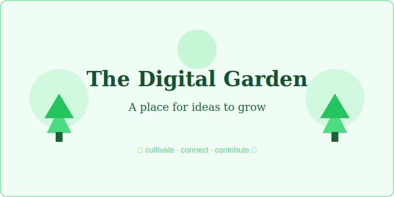

## What is a Digital Garden?

A digital garden is a personal online space where ideas are cultivated over time. Unlike a traditional blog with polished, finished posts, a digital garden embraces the concept of learning in public.

### Key Principles

1. **Growth over perfection** — Content evolves continuously
2. **Interconnection** — Ideas link to each other forming a knowledge graph
3. **Topography over chronology** — Organized by topic, not by date

## A Brief History

The concept of digital gardens has roots in the early web, when personal homepages served as curated collections of knowledge. The term gained popularity through writers like Mike Caulfield and Maggie Appleton.

### The Garden vs. The Stream

As Mike Caulfield described it, there are two modes of online content:

- **The Stream**: Social media feeds, blog rolls — ephemeral and chronological
- **The Garden**: Cultivated collections of interconnected notes — timeless and topical

## Why Build a Digital Garden?

Building a digital garden helps you:

- **Think more clearly** by writing things down
- **Share knowledge** in a low-pressure format
- **Build in public** and attract like-minded people
- **Create a personal reference** you can always return to
